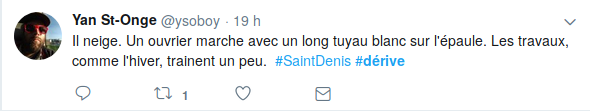

<!-- .slide: data-background-image="img/home_ver2.png" data-background-size="contain"-->
<!-- .slide: class="hover"-->

## Voyage au bout de la ville. _Dérives_ dans Montréal

Enrico Agostini-Marchese
 
On the Move: narratives of travel, displacement and mobilities
 
Vancouver - 2019/10/25

 <!-- .element: class="logo" style="width:30%; background-color:ghostwhite;padding: 5px" -->

<!-- .element: style="font-size:1.4rem" -->

 <!-- .element: class="logo" -->
§§§§§§§§§§§§§§§§§§§§§§§§§§§§§§§§§§§§§§§§§§§§§
<!-- .slide: data-background-image="img/chaire.png" data-background-size="contain"-->
%%%%%%%%%%%%%%%%%%%%%%%%%%%%%%%%%%%%%%%%%%%%%
<!-- .slide: data-background-image="img/home_ver1.png" -->
<!-- .slide: class="hover"-->
### _Dérives_

Chantier littéraire montréalais

§§§§§§§§§§§§§§§§§§§§§§§§§§§§§§§§§§§§§§§§§§§§§
<!-- .slide: data-background-image="img/regles.png" -->
<!-- .slide: class="hover"-->

### Au début, Hochelaga

<small>
- Les billets de cette expérience d'écriture à quatre mains doivent être marqués dérive ainsi que série [avec le numéro de la série].
- Les billets dérive doivent être produit de manière alterne, en succession, un en réponse à l'autre. Chaque contribution guide la série en cours.
- Chaque série est faite de 8 éléments (textes, photos, sons, etc.) glânés dans le quartier d'Hochelaga.
- La première série commence avec cette photo, spark. La deuxième commencera avec une contribution de VW, et ainsi de suite.
- Le nombre total de séries est indéterminé.
- Les règles peuvent être modifiées à tout moment, sans préavis.
</small>
§§§§§§§§§§§§§§§§§§§§§§§§§§§§§§§§§§§§§§§§§§§§§
<!-- .slide: data-background-image="img/derivedisparuetwitter.png" -->
<!-- .slide: class="hover"-->

### Changing places : UQÀM

- Échanges papier (perdus par la poste É.-U.)
- Instagram
- Twitter
§§§§§§§§§§§§§§§§§§§§§§§§§§§§§§§§§§§§§§§§§§§§§
<!-- .slide: data-background-image="img/archi.jpg" -->
<!-- .slide: class="hover"-->

## La production de l'espacce

- Pratique spatiale : qui englobe production et reproduction, lieux spécifiés et ensembles spatiaux propres à chaque formation sociale.
- Les représentations de l’espace, liées aux rapports de production, à l’“ordre” qu’ils imposent.
- Les espaces de représentation, présentant des symbolismes complexes.
§§§§§§§§§§§§§§§§§§§§§§§§§§§§§§§§§§§§§§§§§§§§§
<!-- .slide: data-background-image="img/richter.jpg" -->
<!-- .slide: class="hover"-->
## L'art, une question d'hiérarchie
<small>
> _Les espaces de représentation_, c’est-à-dire l’espace _vécu_ à travers les images et symboles qui l’accompagnent, donc espace des “habitants”, des  “usagers”, mais aussi de certains artistes et peut-être de ceux qui _décrivent_ et croient seulement décrire : les écrivains, les philosophes. C’est l’espace dominé, donc subi, que tente de modifier et d’appropries l’imagination. Il recouvre l’espace physique en utilisant symboliquement ses objets

</small>

Henri Lefebvre, _La production de l'espace_

<!-- .element: class="source" -->
§§§§§§§§§§§§§§§§§§§§§§§§§§§§§§§§§§§§§§§§§§§§§
<!-- .slide: data-background-image="img/derive.jpg" data-background-size="cover"-->
<!-- .slide: class="hover"-->
### Lynch et la ville poly-relationnelle

> « Above all, if the environment is visibly organized and sharply identified, then the citizen can inform it with his own meaning and connections. Then it will become a true _place_ »

> « Nothing is experienced by itself, but always in relation to its surrounding »

> « A two-way process between the observer and his environment. The environment suggests distinctions and relations, and the observer [...] selects, organizes, and endows with meaning what he sees »

<!-- .element: style="font-size:1.4rem" -->

Kevin Lynch, _The Image of the City_

<!-- .element: class="source" -->

§§§§§§§§§§§§§§§§§§§§§§§§§§§§§§§§§§§§§§§§§§§§§

<!-- .slide: data-background-image="img/hochelaga.jpg" data-background-size="cover"-->

### Hochelaga, terre des âmes

§§§§§§§§§§§§§§§§§§§§§§§§§§§§§§§§§§§§§§§§§§§§§
<!-- .slide: data-background-image="img/hochelaga.jpg" data-background-size="cover"-->
<!-- .slide: class="hover"-->

§§§§§§§§§§§§§§§§§§§§§§§§§§§§§§§§§§§§§§§§§§§§§
<!-- .slide: data-background-image="img/hochelaga.jpg" data-background-size="cover"-->
<!-- .slide: class="hover"-->

§§§§§§§§§§§§§§§§§§§§§§§§§§§§§§§§§§§§§§§§§§§§§
<!-- .slide: data-background-image="img/hochelaga.jpg" data-background-size="cover"-->
<!-- .slide: class="hover"-->
### Hocher, élaguer, Victoria Welby, 11 août 2011

<small>
Ma première vie dans le quartier se déroulait dans Maisonneuve, qu'on opposait alors à Hochelaga (de l'autre côté de Pie-IX). HoMa est arrivé plus tard. Les divisions restent pourtant, bien que transformées. On habite au nord ou au sud d'Ontario; on s'en rejouit ou pas.

À l'époque de cette autre vie anté-HoMa, le chemin de fer était encore partie prenante du quartier (avant de devenir vestiges décoratifs place Simon-Valois). Il le divisait d'une grande bande industrielle inhumaine. Comme l'autoroute Ville-Marie. Le Métropolitain. Le chemin de fer qui passe par Outremont (séparant Outremont-kasher et Outremont-pas-cher — on n'oserait jamais planté un chemin de fer dans Outremont-ma-chère...) pour aller rejoindre le fleuve dans Hochelaga. Du mauvais urbanisme. Du très mauvais urbanisme.
</small>
§§§§§§§§§§§§§§§§§§§§§§§§§§§§§§§§§§§§§§§§§§§§§
<!-- .slide: data-background-image="img/hochelaga.jpg" data-background-size="cover"-->
<!-- .slide: class="hover"-->

> J'ai fini par opter pour un lieu qui n'en était pas un, ou si petit, ou si peu habitable. Du cordage à bateau recouvrait un poteau de soutènement dans le sous-sol chez mes parents. Une année, je l'ai décoré de boules, de guirlandes et de lumières, ça nous a tenu lieu de sapin de Noël. C'est le seul espace qui m'a vraiment appartenu gamine et adolescente, qu'on m'a laissé m'approprier. [...] Cette incarnation, il me semble [...] est nécessaire à la dérive.

Victoria Welby, "Nowhere"

<!-- .element: class="source" -->
§§§§§§§§§§§§§§§§§§§§§§§§§§§§§§§§§§§§§§§§§§§§§

<!-- .slide: data-background-image="img/hochelaga.jpg" data-background-size="cover"-->
<!-- .slide: class="hover"-->

§§§§§§§§§§§§§§§§§§§§§§§§§§§§§§§§§§§§§§§§§§§§§

<!-- .slide: data-background-image="img/flamand.png" data-background-size="contain"-->
<!-- .slide: class="hover"-->
### Twitter

- "#NameOfAPlace", "#dérive", _placetelling_

§§§§§§§§§§§§§§§§§§§§§§§§§§§§§§§§§§§§§§§§§§§§§
<!-- .slide: data-background-image="img/home_ver1.png" -->
<!-- .slide: class="hover"-->

§§§§§§§§§§§§§§§§§§§§§§§§§§§§§§§§§§§§§§§§§§§§§
<!-- .slide: data-background-image="img/home_ver1.png" -->
<!-- .slide: class="hover"-->

§§§§§§§§§§§§§§§§§§§§§§§§§§§§§§§§§§§§§§§§§§§§§
<!-- .slide: data-background-image="img/home_ver1.png" -->
<!-- .slide: class="hover"-->

§§§§§§§§§§§§§§§§§§§§§§§§§§§§§§§§§§§§§§§§§§§§§
<!-- .slide: data-background-image="img/home_ver1.png" -->
<!-- .slide: class="hover"-->

§§§§§§§§§§§§§§§§§§§§§§§§§§§§§§§§§§§§§§§§§§§§§
<!-- .slide: data-background-image="img/home_ver1.png" -->
<!-- .slide: class="hover"-->

§§§§§§§§§§§§§§§§§§§§§§§§§§§§§§§§§§§§§§§§§§§§§
<!-- .slide: data-background-image="img/home_ver1.png" -->
<!-- .slide: class="hover"-->

§§§§§§§§§§§§§§§§§§§§§§§§§§§§§§§§§§§§§§§§§§§§§
<!-- .slide: data-background-image="img/home_ver1.png" -->
<!-- .slide: class="hover"-->

§§§§§§§§§§§§§§§§§§§§§§§§§§§§§§§§§§§§§§§§§§§§§
<!-- .slide: data-background-image="img/derive_paris.png" data-background-size="contain"-->
§§§§§§§§§§§§§§§§§§§§§§§§§§§§§§§§§§§§§§§§§§§§§
<!-- .slide: data-background-image="img/derive_us.png" data-background-size="contain"-->

§§§§§§§§§§§§§§§§§§§§§§§§§§§§§§§§§§§§§§§§§§§§§
<!-- .slide: data-background-image="img/matisse.jpg" -->
<!-- .slide: class="hover"-->

### L'idée du lieu

<small>
> « le lieu […] existe d’abord et avant tout comme un réseau discursif, donc comme une série et une accumulation de discours, qui en détermine et façonne les limites, les constituantes, l’histoire, les paramètres, etc […] Selon cette hypothèse, l’existence discursive du lieu accompagnerait son existence _réelle_ […] soit sa matérialité, l’expérience vécue de ceux qui l’habitent ou le visitent, etc. Pour tout lieu, on constaterait ainsi une double existence : discursive (ce qu’on en dit) et phénoménologique (ce qu’on en sait par l’expérience) […] Il n’y a pas, _a priori_, l’une de ces existences qui soit plus importante que l’autre : le lieu existe à la fois par sa matérialité et par son discours. Il n’y a même pas, comme nous le démontreront plus loin, d’antériorité de l’une sur l’autre »

</small>
Daniel Chartier, « Penser le lieu comme discours », 2013

<!-- .element: class="source" -->
§§§§§§§§§§§§§§§§§§§§§§§§§§§§§§§§§§§§§§§§§§§§§
<!-- .slide: data-background-image="img/love.jpg"-->
<!-- .slide: class="hover"-->

> « La première phase de l’amour urbain est celle cartographique : elle a lieu lorsque l’on ressent la carte de la ville aimée se superposer à n’importe quelle autre. Tomber amoureux d’une ville veut dire sentir, quand on la parcourt, que les limites matérielles entre son corps et ses rues se dissolvent, quand la carte devient anatomie. La deuxième phase est celle de l’écriture. La ville prolifère dans toutes les formes possibles du signe : d’abord elle se fait prose, ensuite poésie et finalement elle devient évangile ».

Paul B. Preciado, « Aimer une ville »

<!-- .element: class="source" -->
§§§§§§§§§§§§§§§§§§§§§§§§§§§§§§§§§§§§§§§§§§§§§
<!-- .slide: data-background-image="img/parka.jpg" -->
<!-- .slide: class="hover"-->

> « Dérive = réalité augmentée sans technologie. Faut ouvrir les yeux, les oreilles, les narines, la bouche, tendre les mains. Marcher dans la ville. Ou ailleurs. Ralentir. Flâner. Observer. Se laisser imprégner. Errer. Et, surtout, avoir du plaisir à le faire. Et puis écrire si le cœur nous en dit ».

Pharaon Parka, « La #dérive expliquée à la génération Y »
<!-- .element: class="source" -->
